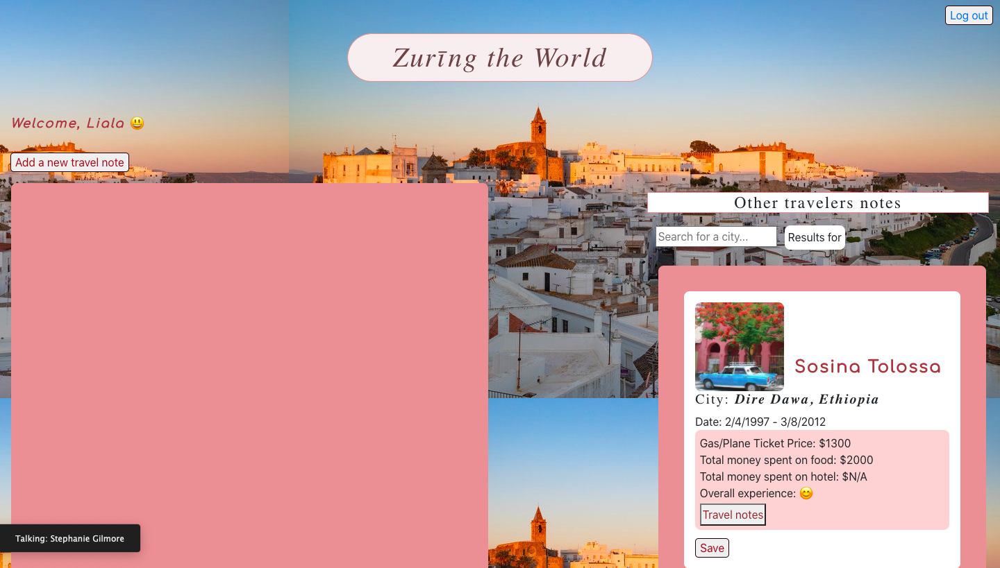
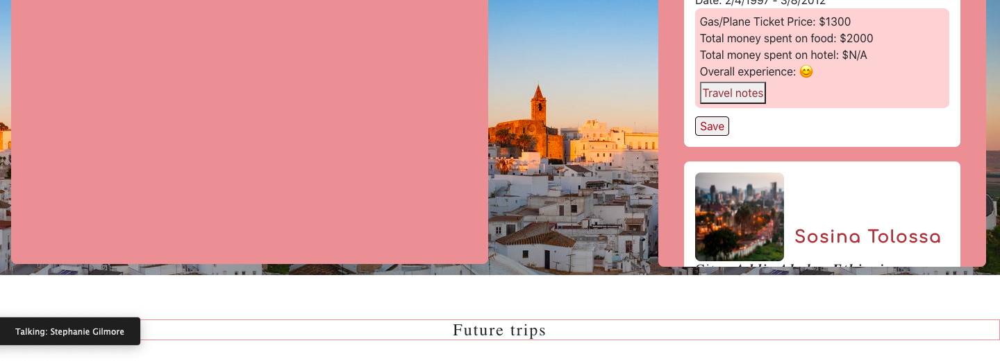

# Zurīng the World
Zurīng the World is intended to make having a journal of trips taken easy--- allowing the user to see notes of all of their traveling experiences, other travelers notes, and save a list of future trips. Zurīng the World provides easy access to users to capture all of the cool things they do during their trips and moments they feel during these times. Along with this, they can also get their research done on future trips they want to take because this site will allow them read other travels notes on trips they've taken. And if they like what they're seeing(reading) about these trips, they can easily save the name of the cities under their future trips list with one click of a button.

## Table of Contents
  * [Project Requirements and Features List](#project-requirements-and-features-list)
  * [Technologies Used](#technologies-used)
  * [Installing and Launching Zurīng the World](#instructions-for-installing-zurīng-the-world)
  * [Appendix 1: Planning Documentation](#appendix-1-planning-documentation)
    * [Entity Relationship Diagrams](#entity-relationship-diagram)
    * [Wireframes](#wireframes)
  * [Appendix 2: Set Up Instructions](#appendix-2-set-up-instructions)

## Project Requirements and Features List
### Get Started
When a user first registers an account with Zurīng the World, they will be taken a page with a section on the left where they add notes of trips they've taken, section on the right where they can see other travelers notes, and a section on bottom of the page where they can save future trips. 
</img> </img>

### Adding Notes
When the user wants to add a note on a trip they've taken, they will click 'Add a new travel note button' located on top left corner. They then will be presented with a form that asks general questions about their trip. They then will fill out all of the required information otherwise they will not be able to save the note. Once they fill out all of the required information, they can click 'Add note' button located on the bottom of the form and the note will be saved. 

### Editing Notes
If a user wants to edit one of their trip notes for any reason, they can clit 'Edit' button under the note they want to edit. When they do that, a form they've filled out in order to save that note, will get displayed. They then can edit any one of those saved information including replacing the picture they used for this note before and click 'Save' and the note will get updated.

