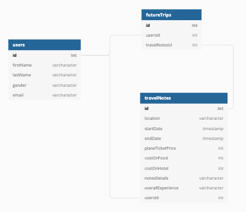
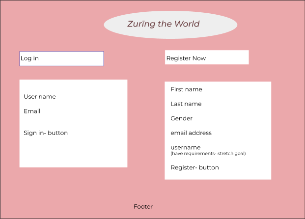
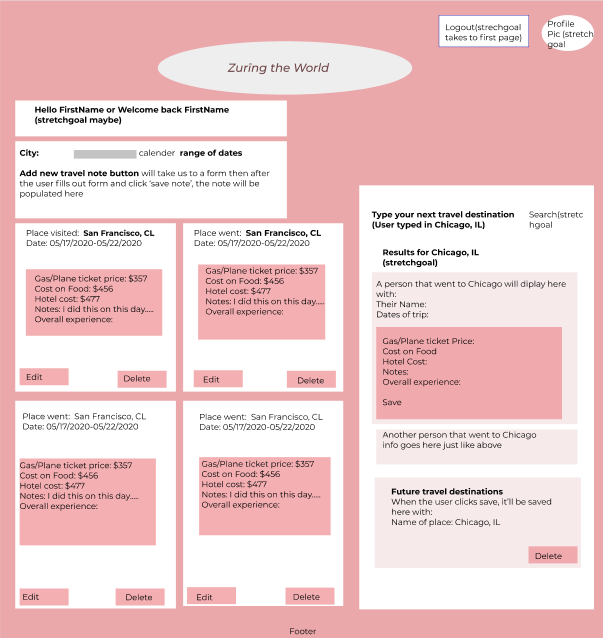
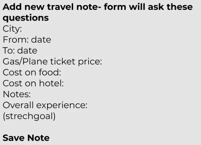
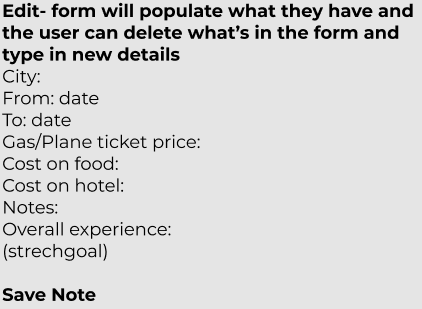

# Zurīng the World
Zurīng the World is intended to make having a journal of trips taken easy--- allowing the user to see notes of all of their traveling experiences, other travelers notes, and save a list of future trips. Zurīng the World provides easy access to users to capture all of the cool things they do during their trips and moments they feel during these times. Along with this, they can get their research done on trips they want to take in the future because this site will allow them read other travelers' notes of trips the travelers have taken. And if they like what they're seeing about these trips, they can easily save the name of the cities under their future trips list with one click of a button.

## Table of Contents
  * [Project Requirements and Features List](#project-requirements-and-features-list)
  * [Technologies Used](#technologies-used)
  * [Installing and Launching Zurīng the World](#instructions-for-installing-zurīng-the-world)
  * [Appendix 1: Planning Documentation](#appendix-1-planning-documentation)
    * [Entity Relationship Diagrams](#entity-relationship-diagram)
    * [Wireframes](#wireframes)
  * [Appendix 2: Set Up Instructions](#appendix-2-set-up-instructions)

## Project Requirements and Features List
### Get Started
When a user first registers an account with Zurīng the World, they will be taken to a page with a section on the left where they would add notes on trips they've taken, a section on the right where they can see other travelers notes of trips the travelers have taken, and a section on bottom of the page where they can save future trips they want to take. 
<br>
</img>
</img>

### Adding Notes
When the user want to add a note on a trip they've taken, they will click 'Add a new travel note' button located on top left corner. They then will be presented with a form that asks general questions about their trip. They have to fill out all of the required information of the form otherwise they will not be able to save the note. Once they fill out all of the required information of the form, they can click 'Add note' button located on the bottom of the form and the note will be saved. 

### Editing Notes
If a user want to edit one of their trip note for any reason, they can click 'Edit' button under the note they want to edit. When they do that, a form they've filled out in order to save that note will get displayed. They then can edit any one of those saved information including replacing the picture they've used for this note when they were adding it. After the user edited the information they wanted to edit, they can click 'Save' button and the note will get updated.

### Viewing Other Travelers Notes and Saving Future Trips
When a user want to read about other cities, they will just have to look on the right page of the homepage. There, they can find different travelers' notes on cities these travelers visited. If the user reads these notes and feel like it will be nice to visit one of these cities, they can click 'Save' button under the city they're interested on visiting, and that city's name will be added under their 'Future trips' list located on the bottom of the page.


## Technologies Used
  ### Development Languages and Libraries
  </img> 
  </img>
  </img> 
  </img> 

  ### Development Tools
  </img>
  </img>
  </img> 
  </img> 
  </img>
 
## Instructions for Installing Simplified Supper
  To launch the Zurīng the World app, you will need to have access to command line tools, node package manager, JSON Server. If you do not have access to any of these tools, you can find instructions for installing them in the [Appendix.](#appendix-2-set-up-instructions)

  Clone this repo on you personal machine using the following command
  ```sh
    git clone git@github.com:sosinatolossa/zuring-the-world.git
  ```

  Install the NPM dependencies for this project using the following commands
  ```sh
    cd zuring-the-world
    npm install
  ```

  From your terminal window, type
  ```sh
    npm start
  ```

  Now that the server is up and running, you can open an internet browser and access the application
  ```sh
    http://localhost:8080/
  ```

 ### Congratulations you are now experiencing Zurīng the World!

  ## Appendix 1: Planning Documentation

  ### Entity Relationship Diagram
  

  ### Wireframes/ Mockups
  </img> </img>
  </img> </img>

  ## Appendix 2: Set Up Instructions

  You will need to have command line tools installed for your computer to use terminal commands.

  Linux/ Windows users, please visit the [Git page](https://git-scm.com/book/en/v2/Getting-Started-Installing-Git) and follow the instructions for set up

  Mac users follow the instructions below

  Open your terminal and type
  ```sh
    git --version
  ```

  You will now need to configure your git account. In the terminal window, type:
  ```sh
    git config -global user.name "Your Name"
    git config -global user.email "Your Email"
  ```

  If you do not have Node.js installed on your machine, visit the [Node.js Download Page](https://nodejs.org/en/download/) and  follow the instructions. To ensure that it is installed correctly, in your terminal window, type
  ```sh
    echo $PATH
  ```
  Ensure that the result has the following in the $PATH
  ```sh
    /usr/local/bin
    or
    /usr/local/bin:/usr/bin:/bin:/usr/sbin:/sbin
  ```

  Now you can follow the [installation instructions](#instructions-for-installing-zuring-the-world) to get Zurīng the World up and running on your machine.

  This project was bootstrapped with [Create React App](https://github.com/facebook/create-react-app).
